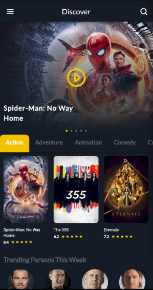
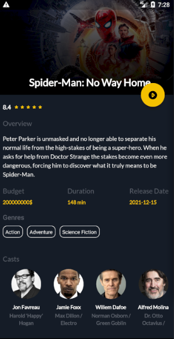

# Movie App Implemented with Flutter

Using BLoc Pattern and JSON API.
Data Provider: https://www.themoviedb.org

<br/>
## Getting Started

This app aids getting timely information of wide range of movie information as made available through the MovieDB public APIs.

If you have an Android/iOS device you could build and install it on it. If you do not have a device you could test this app with, you could run it on an Android/iOS emulator.

## Installation

Make sure you have the following installed on your system:

- Anroid Emulator
- Flutter SDK
- Android studio or VS Code

Test if your installations are intact by running

```bash
flutter doctor
```

Build the app by running

```bash
flutter run
```

## Screenshots


</br>

</br>
